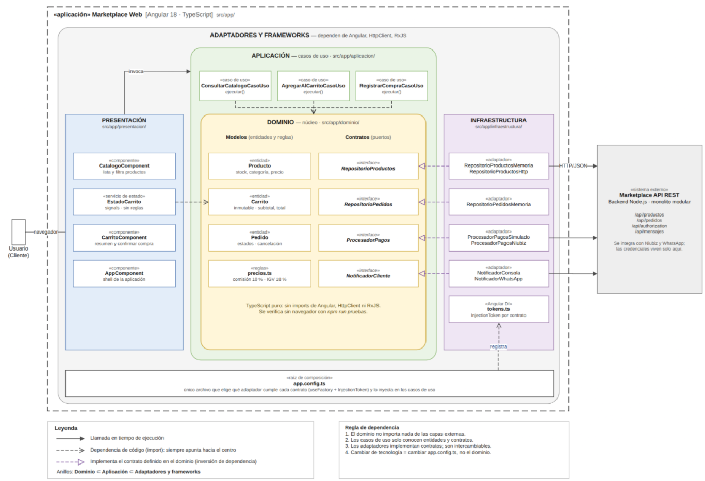

# Enfoque arquitectónico

## Clean Architecture

El Marketplace utilizará Clean Architecture para separar las reglas del negocio de la interfaz de usuario y de las tecnologías externas.

Las dependencias del código apuntarán hacia el interior: el Dominio no dependerá de Angular, de la base de datos ni de la pasarela de pago.

## Características del enfoque

| Elemento | Descripción aplicada al Marketplace |
|---|---|
| Patrón / enfoque arquitectónico | Clean Architecture (Arquitectura Limpia). |
| Objetivo | Separar responsabilidades y controlar las dependencias hacia el dominio. |
| ¿Qué problema resuelve? | Evita que las reglas del negocio dependan directamente de la interfaz Angular, la base de datos, las API y los servicios de pago. |
| Capas definidas | Dominio, Aplicación, Presentación e Infraestructura. |
| Beneficios | Facilita el mantenimiento, las pruebas unitarias y el cambio de tecnologías sin modificar innecesariamente las reglas del negocio. |

## Diagrama del enfoque arquitectónico

