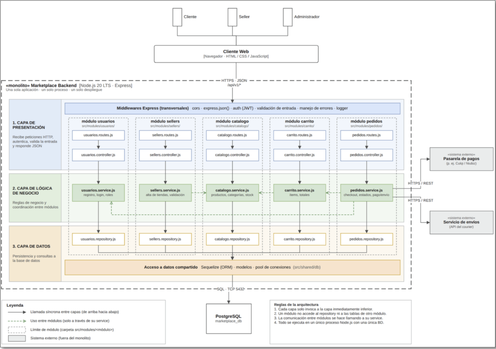

# Estilo arquitectónico

## Estilo seleccionado: monolito modular

El Marketplace se organizará como un monolito modular. El backend será una misma aplicación desplegable, dividida en módulos con responsabilidades definidas.

La aplicación web se comunicará con el backend mediante una API REST.

## Diagrama de arquitectura

